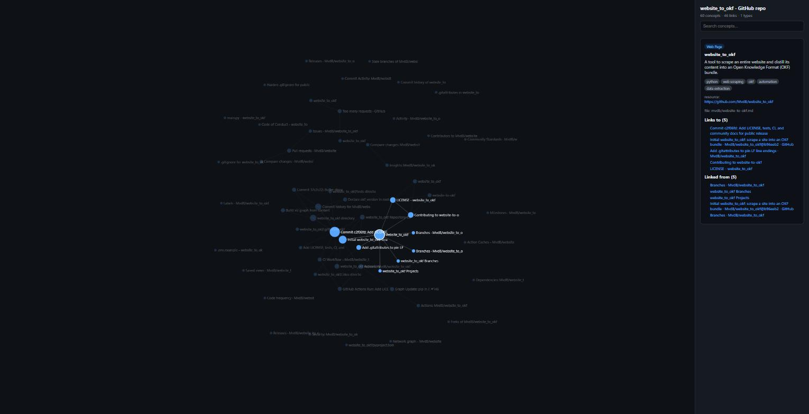

# website-to-okf

[](https://github.com/MvdB/website_to_okf/actions/workflows/ci.yml)
[](LICENSE)

Scrape a whole website and distill it into an **[Open Knowledge Format (OKF)](https://github.com/GoogleCloudPlatform/knowledge-catalog/tree/main/okf)** bundle — a directory of markdown files with YAML frontmatter. Only the raw content and its linkage are kept; design and recurring chrome (headers, footers, nav, banners) are stripped.

## Pipeline

```
discover  →  fetch + extract  →  distill  →  write OKF
(sitemap    (engine:            (LLM via     (one concept.md
 first,      crawl4ai or         OpenAI-       per URL, index.md
 crawl       trafilatura)        compatible    nav, log.md,
 fallback)                       API)          manifest.json)
```

- **Discovery** — sitemap-first (`robots.txt` hints, `/sitemap.xml`, sitemap indexes, nested/gzip sitemaps); same-domain BFS crawl fallback when no sitemap.
- **Fetch + extract (pluggable engine)**:
  - **`crawl4ai`** (default) — headless-browser crawling with `fit_markdown` (pruning content filter). Robust on JS-heavy / anti-bot sites.
  - **`trafilatura`** (`--engine trafilatura`) — lightweight, static-first `httpx` with robots.txt, per-host rate limiting and retries; falls back to a headless **Playwright** browser only when static content looks thin/JS-gated. Faster and lighter for mostly-static sites.
- **Distill** — an LLM (any OpenAI-compatible endpoint — local Ollama/LM Studio/vLLM or cloud) cleans the markdown and generates `title` / `description` / `tags`. Cached by content hash; degrades to the heuristic extraction on error. Skip entirely with `--no-llm`. This is also what removes any residual nav the extractor leaves behind.
- **Write** — one OKF concept per URL, mirroring the URL tree; internal links rewritten to bundle-relative (`/a/b.md`); reserved `index.md` / `log.md` generated (the root `index.md` declares `okf_version`); `manifest.json` records the url ↔ path ↔ hash map. Runs are resumable via per-stage buffers (see below).

## Install

```bash
pip install -e .
# the default crawl4ai engine needs a browser once:
playwright install chromium
```

To run with the lightweight engine and skip the browser entirely, use
`--engine trafilatura` (add `pip install -e ".[browser]" && playwright install chromium`
only if you also want its thin-content browser fallback).

## Usage

```bash
# Extraction only, no model calls (fast smoke test):
python main.py https://example.com -o ./bundle --no-llm --max-pages 20

# Lightweight static engine (no browser):
python main.py https://example.com -o ./bundle --engine trafilatura --no-llm

# With a local OpenAI-compatible model:
python main.py https://example.com -o ./bundle \
    --base-url http://localhost:11434/v1 --model llama3.1 --api-key not-needed

# With a cloud model (uses OPENAI_API_KEY / OPENAI_BASE_URL from env):
python main.py https://example.com -o ./bundle --model gpt-4o-mini
```

Configuration can also come from environment variables (`W2OKF_*`, plus the usual
`OPENAI_API_KEY` / `OPENAI_BASE_URL` / `OPENAI_MODEL`) or a local `.env` file.

Run `python main.py --help` for all flags.

## Output bundle

```
bundle/
  index.md            # nav index (progressive disclosure); root declares okf_version
  log.md              # run history
  manifest.json       # url <-> path <-> hash
  viz.html            # self-contained concept-graph viewer (no external deps)
  home.md             # the site root as a concept
  blog/
    index.md
    my-post.md        # frontmatter: type/title/description/resource/tags/timestamp
  ...                 # each concept ends with a "# Citations" link to its source URL
```

Open `bundle/viz.html` in a browser to explore the concept graph (nodes = pages,
edges = content links; click a node for its metadata, backlinks, and source).
Disable extras with `--no-viz` / `--no-citations`.



*`viz.html` generated by running this tool on its own repository — each node is a
page, edges are the content links between them, and selecting a node reveals its
type, distilled description, tags, source URL, and backlinks.*

## Resumable runs

Every stage is checkpointed under `<bundle>/.cache/` (git-ignored), so an
interrupted crawl or a restarted model never costs you completed work — just
re-run the same command:

- **discover** → `discovered.json` (skips sitemap re-fetch)
- **fetch + extract** → `extracted/<hash>.json`, written per page as it lands
  (re-fetches only pages not already buffered)
- **distill** → content-hash cache + `url_to_hash.json` (non-destructive; a
  transient model failure keeps the prior distilled result)

Pass `--fresh` to ignore the discover/fetch buffers and re-crawl (the distill
cache stays valid and is still reused).

## Development

```bash
pip install -e ".[dev]"
ruff check website_to_okf tests   # lint
pytest -q                         # fast, offline unit tests
```

The unit suite is pure and offline (no network, browser, or model), so it runs
in well under a second. CI runs the same checks on Python 3.10–3.13. See
[CONTRIBUTING.md](CONTRIBUTING.md).

## License

[Apache-2.0](LICENSE) © Michael van den Berg
